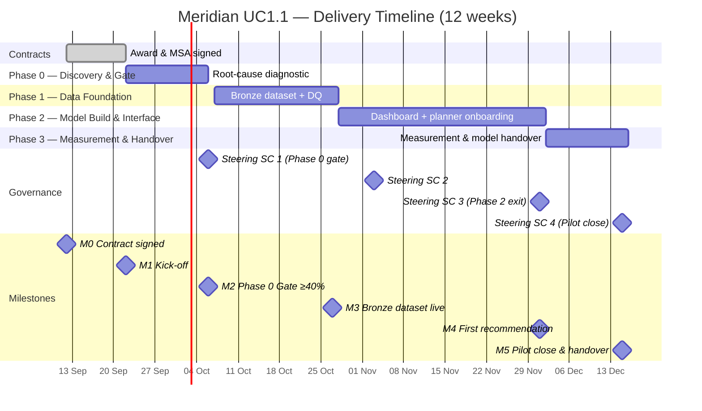

# Meridian UC1.1 Pilot — Milestone Timeline



---

## Dependency Chain — Plain-Language Reading

```
M0 Contract signed (12 Sep)
  └─► M1 Kick-off (22 Sep)  [10-day mobilisation window]
        └─► Phase 0 — 2 weeks — root-cause diagnostic + POS audit
              └─► M2 Phase 0 Gate (6 Oct)  [HARD GATE — 40% threshold; arbiter named]
                    └─► Phase 1 — 3 weeks — bronze dataset + data quality sign-off
                          └─► M3 Bronze Dataset Live (27 Oct)
                                └─► Phase 2 — 5 weeks — dashboard + planner onboarding
                                      └─► M4 First Recommendation (1 Dec)  [accept rate ≥30%]
                                            └─► Phase 3 — 2 weeks — measurement + handover
                                                  └─► M5 Pilot Close (15 Dec)  [adoption ≥70%]
```

**Critical path note.** The single longest dependency chain is SAP credentials → Phase 0 diagnostic → Phase 0 gate → Phase 1 data load. A Day-5 credential miss (A1 in the assumption register) shifts every downstream milestone day-for-day. There is no parallel path that absorbs a SAP access delay; the right-to-pause clock is the only contractual buffer.

**Phase 2 Champion activation gate.** Phase 2 cannot start without the Executive Sponsor's written mandate to planners on file. This is independent of the M3 data milestone and is not on the critical path if issued before 2026-11-28 (3 days before Phase 2 start).

---

## Governance Rhythm Overlay

| Week | Sprint event | Steering | OCM |
|------|-------------|----------|-----|
| 2 | Sprint review (Phase 0) | SC1 — Phase 0 gate | — |
| 4 | Sprint review + retro | — | Prosci stakeholder mapping |
| 6 | Sprint review + retro | — | Champion onboarding session 1 |
| 7 | — | SC2 | — |
| 8 | Sprint review + retro | — | OCM workshop 1 (planners) |
| 10 | Sprint review + retro | — | OCM workshop 2 (planners) |
| 11 | Sprint review | SC3 — Phase 2 exit / first rec | — |
| 12 | Sprint review + retro | SC4 — Pilot close | Prosci adoption report |
