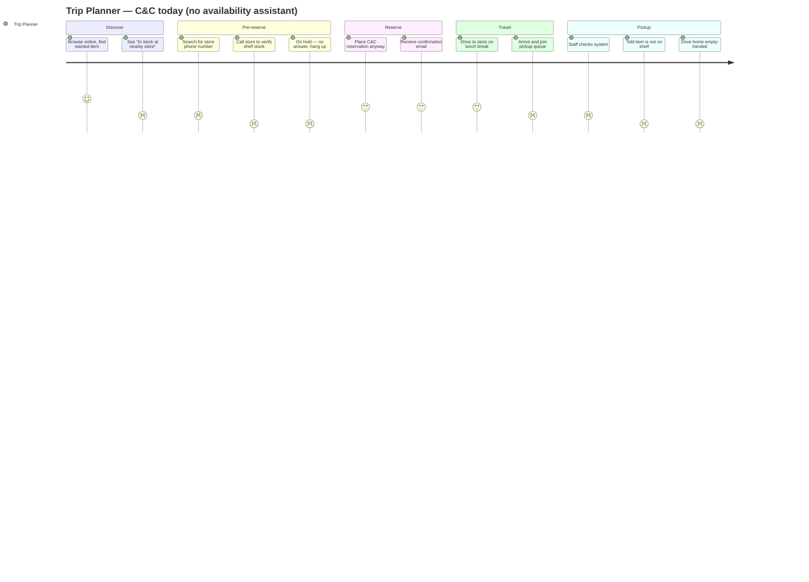

# Personas & Journey Map

---

## Persona 1 — The Trip Planner

**Goal:** Complete a pickup in a single planned trip — slotted into a commute or lunch break — with zero surprises on arrival. Certainty matters more than speed.

**Friction:** Has been burned by a phantom-stock cancellation before. No longer trusts "In stock at nearby store" on the product page. The website said available; the shelf was empty on arrival.

**Current workaround:** Phones the store during opening hours and asks a staff member to physically check the shelf before reserving. Often no answer or a 5-minute hold. If no answer: either skips the purchase or reserves and accepts the risk — then anxiously checks email for a cancellation notification while driving to the store. [unverified — drawn from consumer forum reports pre-2025; needs primary validation]

---

## Persona 2 — The Same-Day Seeker

**Goal:** Get the item today. Triggered by a flash sale, social post, or sudden need. Speed over certainty; will not wait for home delivery.

**Friction:** Fast-moving items may have sold down below what the SAP count shows by the time they check. Needs rapid confirmation but has no time to call a store; accepts higher cancellation risk as a trade-off for immediacy.

**Current workaround:** Books click-&-collect at two nearby stores simultaneously and travels to whichever sends a pickup-ready SMS first; cancels the duplicate. Occasionally orders home delivery in parallel as a backup. [unverified — drawn from UK/FR apparel forum reports pre-2025; needs primary validation]

**Why these two contrast:** Persona 1 sacrifices time upfront (phone call, planning) to guarantee certainty. Persona 2 uses redundancy (parallel bookings) to manage risk. Both workarounds are symptoms of the same missing signal — neither would exist if the inventory count were trustworthy.

---

## Journey Map — Trip Planner (current state, no AI assistant)

Traces one trip-planner's path from discovery to failed pickup. Satisfaction scores 1–5; the emotional low point clusters at "Call store" and "Told: not on shelf" — the two moments this feature is designed to collapse.

---

## Top Three Unmet Needs

**Need 1 — A trustworthy availability signal before commitment.**
Shoppers cannot distinguish "definitely on shelf" from "system count from yesterday's sync." The gap forces the phone-call workaround (Persona 1) or parallel-booking hedge (Persona 2). The need: a signal that reflects shelf reality at reservation time, derived from same-day POS velocity and adjustment events — not just a raw SAP count.
*Evidence: Verbatim 1–3 (02-primary-signal.md) — customers explicitly describe the "website says in stock, store says gone" failure.*

**Need 2 — Confidence calibrated to store context and recency.**
Not all "In stock" signals carry the same risk. A Tuesday at a low-footfall store differs from a Saturday flash sale at a high-velocity city-centre location. The unmet need is a signal that accounts for store-level sell-through rate and time since last OMS sync — not a binary flag.
*Evidence: inferred from Meridian's 12% phantom stock rate despite SAP integration (01-context-brief.md); store-level variance is the unexplained gap. [partially unverified — store-level breakdown not in primary signal]*

**Need 3 — Alternatives surfaced at the decision point, not after failure.**
Cancellation notifications arrive by email after the shopper has already driven to the store. The unmet need is: show alternatives (another store with High confidence, or shift to home delivery) at the moment of low-confidence signal — before the reservation is placed and before the trip is taken.
*Evidence: post-cancellation churn to Zalando/ASOS (Verbatims 1–3, 02-primary-signal.md) suggests shoppers find alternatives elsewhere because Meridian surfaces none.*
