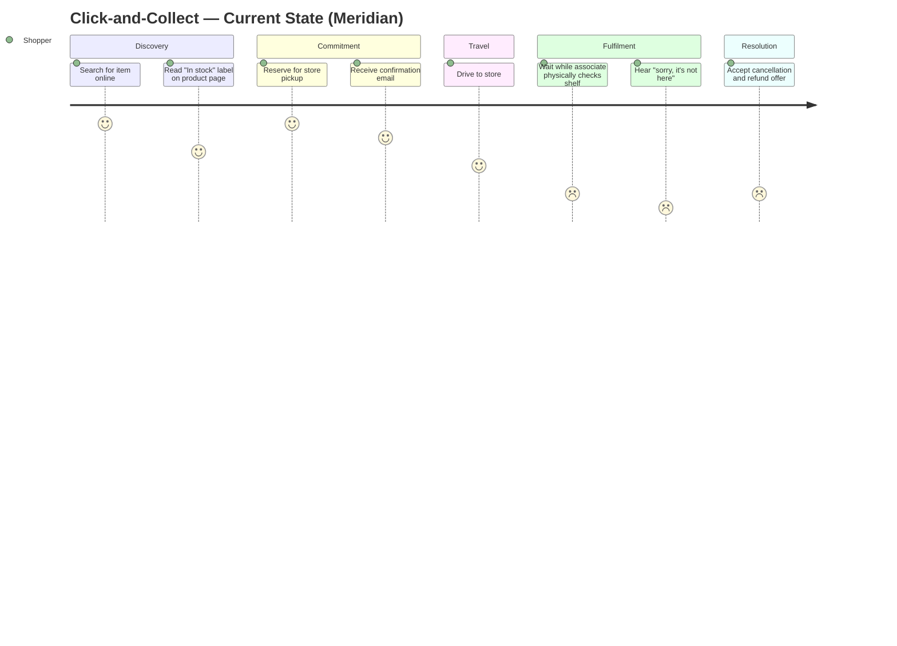

# Journey Map: Click-and-Collect (Current State)

---

## Mermaid Diagram

Score scale: 9 = delighted · 5 = neutral · 1 = betrayed.

---

## Step-by-Step Detail

| Step | Action | Emotion | Score | Frustrations (up to 3) | Drop-off? |
|------|--------|---------|-------|------------------------|-----------|
| 1 | Search for item online | Hopeful, purposeful | 7 | — | — |
| 2 | Product page: reads "In stock" label | False confidence | 5 | No data-freshness signal / "In stock" conflates warehouse and shelf / no staleness warning | — |
| 3 | Reserve for store pickup | Invested, committed | 7 | No indication the reservation is not a physical hold / no confidence signal before committing / no "choose a safer store" nudge | — |
| 4 | Receive confirmation email | Reassured (falsely) | 6 | Confirmation implies certainty the system cannot deliver / no cancel or re-route option at this stage | — |
| 5 | Drive to store | Anticipatory, slightly anxious | 4 | Time and cost already committed / no real-time update if stock changes during travel / can't act on doubt | — |
| 6 | Wait while associate searches | Tense, passive | 2 | No digital verification tool — analog shelf search / shopper has zero visibility / wait time unspecified | — |
| 7 | Told item is not on shelf | Betrayed, angry | 1 | Failure was preventable and unflagged / no explanation of why it happened / wasted journey cannot be compensated | **⬇ Drop-off** |
| 8 | Accept cancellation + refund | Resigned, done | 2 | Refund is slow / no proactive alternative offered / trust in C&C channel broken | — |

---

## Three Peak Frustrations

| # | Frustration | Step | Why it matters |
|---|------------|------|----------------|
| F1 | **"In stock" is a lie the system tells in good faith.** The label accurately reports the ERP count but implies shelf truth it cannot guarantee. The shopper reads a promise; the system logs a data point. | Step 2 | This is the root cause of every downstream failure. Fix here prevents the wasted trip. |
| F2 | **Commitment without certainty.** The reservation step asks for full behavioural commitment (the trip) on the basis of a label the system already knows is stale-capable. No checkpoint, no escape. | Step 3 | This is where the shopper takes on risk they don't know they're taking. |
| F3 | **No recovery path at the counter.** When the failure occurs, the associate has no tools to offer a real alternative — only cancellation. The system provides no "next best action." | Step 7 | This is where trust exits permanently. One occurrence converts a regular C&C user into a direct competitor's customer. |

---

## Drop-off

**At step 7.** The shopper does not abandon the brand — they abandon the click-and-collect channel. Evidence from the brief: after one phantom-stock failure, the majority defect to Zalando or ASOS. The drop-off is not visible in the reservation funnel; it appears 30–90 days later as C&C channel churn.

The redesign target is step 2 (product page label) and step 3 (reservation gate) — the two moments before the shopper takes on the cost of travel.
