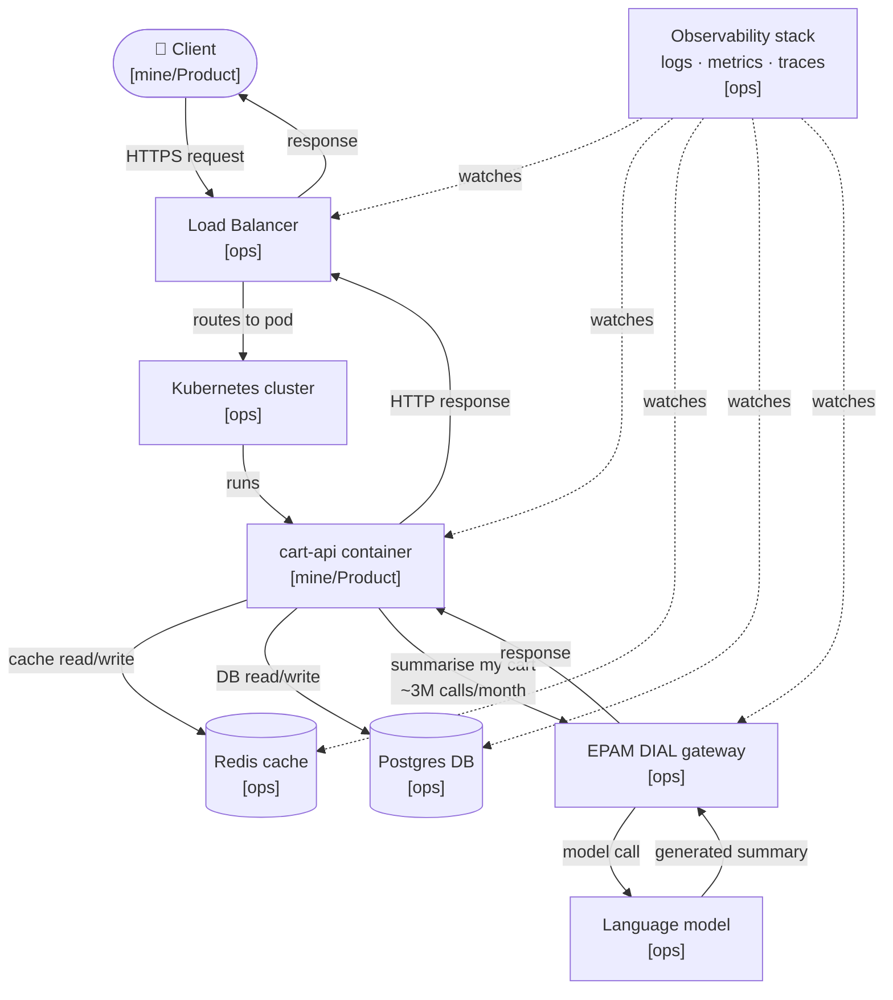

# Stack Map — cart-api

## Component inventory

| Component | What it does | Owner |
|-----------|-------------|-------|
| Client (browser / mobile) | Sends HTTP requests; receives responses | [mine/Product] |
| Load Balancer | Terminates TLS, distributes traffic across pods | [ops] |
| Kubernetes cluster | Schedules and restarts cart-api pods, provides networking | [ops] |
| cart-api container | Handles checkout logic: add/remove items, price calculation, cart summarisation | [mine/Product] |
| Redis | Caches active cart state to reduce DB reads; short TTL | [ops] |
| Postgres | Durable store for cart contents, user data, order history | [ops] |
| EPAM DIAL gateway | Auth, rate-limiting, cost routing for all LLM calls | [ops] |
| Language model (LLM) | Generates "summarise my cart" natural-language output | [ops] |
| Observability stack (metrics / logs / traces) | Collects telemetry from every layer; surfaces latency, errors, cost | [ops] |

**Ownership rule:** the floor (infrastructure, managed services, the gateway) is ops.  
The app's behaviour, acceptance bar, prompt design, and cost envelope are [mine/Product].

---

## Request flow — Mermaid diagram



---

## Ownership split

```
[mine/Product]                      [ops]
──────────────────────────          ──────────────────────────────────────
cart-api container                  Load balancer
  · checkout logic                  Kubernetes cluster (scheduling, networking)
  · prompt design                   Redis (provisioning, patching, HA)
  · acceptance criteria             Postgres (provisioning, backups, HA)
  · AI cost envelope                EPAM DIAL gateway (auth, rate limits, routing)
Client UX                           Language model (hosting, versioning)
                                    Observability stack (ingestion, retention, alerting)
```

**Key implication:** when the cart-api pod is healthy but the Redis node is down,
or the DIAL gateway is rate-limiting, or Postgres replica lag is high —
those are ops incidents. Knowing the boundary now means knowing who to page then.

---

## What observability watches (series anchor)

The observability stack is the single [ops] component that sees every layer.
The rest of this series (latency, cost, failure modes) uses it as the
read surface. The question "how do I know if this is working?" starts here.
